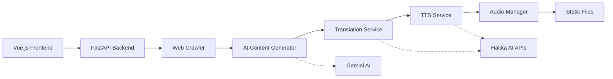

# Hakkast: AI Podcast Generator

An AI-powered personalized Hakka podcast generator that creates custom podcast content using advanced AI technologies.

[](https://vuejs.org)
[](https://fastapi.tiangolo.com)
[](https://python.org)
[](https://docker.com)
[](LICENSE)

## 🌟 Features

- **🤖 AI-Powered Content Generation** - Uses Google Gemini AI for culturally-aware Traditional Chinese script creation
- **🔄 Intelligent Translation Pipeline** - Integrates with official Hakka AI Hackathon APIs for authentic translation
- **🔊 High-Quality TTS** - Professional Hakka text-to-speech synthesis with multiple voice models
- **📱 Web Crawling** - Automated news and content aggregation for topic-based podcast generation
- **⚡ Modern Web Interface** - Responsive Vue.js 3 frontend with Tailwind CSS and shadcn-vue components
- **🎵 Audio Management** - Complete audio processing pipeline with format conversion and merging
- **🐳 Docker Support** - Easy deployment and development with Docker Compose

## 🏗️ Architecture



### 3-Step AI Pipeline

1. **📝 Content Generation**: Gemini AI creates culturally-appropriate Traditional Chinese scripts
2. **🔤 Translation**: Official Hakka AI Hackathon APIs convert to authentic Hakka with romanization
3. **🎵 Audio Synthesis**: Professional TTS generates high-quality Hakka speech

## 🚀 Quick Start

### Prerequisites

- Docker and Docker Compose
- Access to Hakka AI Hackathon APIs
- Google Gemini API key

### Installation with Docker (Recommended)

1. **Clone and setup**
   ```bash
   git clone https://github.com/MO7YW4NG/Hakkast
   cd Hakkast
   ```

2. **Configure environment**
   ```bash
   cp .env.example .env
   # Edit .env with your API credentials
   ```

3. **Run with Docker Compose**
   ```bash
   docker-compose up --build
   ```

The application will be available at:
- **Frontend**: http://localhost:3000
- **Backend API**: http://localhost:8000
- **API Documentation**: http://localhost:8000/docs

### Development Mode

For development with hot reloading:
```bash
docker-compose --profile dev up --build
```

This will start:
- **Frontend dev server**: http://localhost:5173
- **Backend dev server**: http://localhost:8001

## 🔧 Configuration

### Required Environment Variables

```bash
# AI Services
GEMINI_API_KEY=your_gemini_api_key

# Hakka AI Hackathon APIs
HAKKA_USERNAME=your_hackathon_username
HAKKA_PASSWORD=your_hackathon_password
HAKKA_TTS_API_URL=https://hktts.bronci.com.tw
HAKKA_TRANSLATE_API_URL=https://hktrans.bronci.com.tw

# Optional: TWCC Integration
TWCC_API_KEY=your_twcc_key
TWCC_MODEL_NAME=llama3.3-ffm-70b-32k-chat
```

## 🛠️ Project Structure

```
Hakkast/
├── frontend/                  # Vue.js frontend
│   ├── src/
│   │   ├── components/       # Vue components
│   │   ├── views/           # Page components
│   │   ├── stores/          # Pinia stores
│   │   ├── services/        # API services
│   │   └── types/           # TypeScript types
│   ├── public/              # Static assets
│   └── package.json         # Frontend dependencies
├── backend/                  # FastAPI backend
│   ├── app/
│   │   ├── core/            # Configuration and settings
│   │   ├── models/          # Pydantic data models
│   │   ├── routers/         # API route handlers
│   │   ├── services/        # Business logic services
│   │   └── main.py         # FastAPI app initialization
│   ├── static/audio/        # Generated audio files
│   ├── json/               # JSON data and configs
│   └── requirements.txt     # Python dependencies
├── docker-compose.yml       # Docker orchestration
└── README.md               # Project documentation
```

## 🎨 Frontend Features

- **Modern Vue.js 3** with Composition API
- **Vite** for fast development and building
- **Tailwind CSS** for utility-first styling
- **shadcn-vue** for beautiful UI components
- **Pinia** for state management
- **TypeScript** for type safety
- **Responsive Design** for all devices

## 🔧 Backend Features

- **FastAPI** for high-performance REST API
- **Pydantic AI** for AI operations
- **Google Gemini** for content generation
- **Hakka AI APIs** for translation and TTS
- **Web crawling** for content aggregation
- **Audio processing** with FFmpeg
- **Async processing** for better performance

## 🐳 Docker Deployment

### Production Build

```bash
# Build and run production containers
docker-compose up --build
```

### Development Build

```bash
# Build and run development containers with hot reloading
docker-compose --profile dev up --build
```

### Individual Services

```bash
# Run only backend
docker-compose up backend

# Run only frontend
docker-compose up frontend
```

## 🔍 Monitoring & Logging

### Health Checks
```http
GET /health              # Basic health check
GET /health/detailed     # Detailed system status
```

### Logging
- **Application logs**: Structured JSON logging with correlation IDs
- **API logs**: Request/response logging with performance metrics
- **Error tracking**: Comprehensive error reporting and stack traces

## 🤝 Contributing

1. Fork the repository
2. Create a feature branch (`git checkout -b feature/amazing-feature`)
3. Commit your changes (`git commit -m 'Add amazing feature'`)
4. Push to the branch (`git push origin feature/amazing-feature`)
5. Open a Pull Request

### Development Guidelines

- Follow PEP 8 style guidelines for Python
- Use TypeScript for frontend development
- Add type hints to all functions
- Write comprehensive docstrings
- Include unit tests for new features
- Update documentation for API changes

## 📄 License

This project is licensed under the GPL License - see the [LICENSE](LICENSE) file for details.

## 🙏 Acknowledgments

- **Hakka AI Hackathon** - For providing official Hakka translation and TTS APIs
- **Google Gemini** - For advanced AI content generation capabilities
- **FastAPI Community** - For the excellent web framework
- **Vue.js Team** - For the amazing frontend framework
- **客家委員會** - For supporting Hakka language technology development

## 📞 Support

- **Issues**: Report bugs and feature requests via GitHub Issues
- **API Questions**: Refer to the interactive documentation at `/docs`
- **Frontend Issues**: Check the `frontend/README.md` for Vue.js specific help
- **Backend Issues**: Check the `backend/README.md` for FastAPI specific help

---

