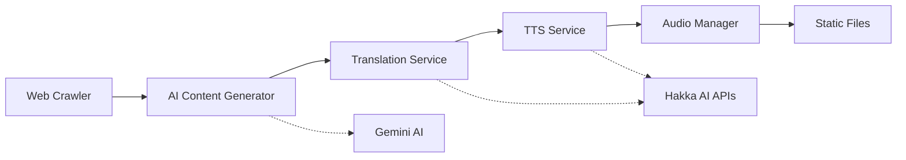

# 🎙️ Hakka AI Podcast Generator

> AI-powered personalized Hakka podcast generator with intelligent 3-step pipeline: Chinese generation → Hakka translation → TTS

[](https://fastapi.tiangolo.com)
[](https://python.org)
[](LICENSE)

## 🌟 Features

- **🤖 AI-Powered Content Generation** - Uses Google Gemini AI for culturally-aware Traditional Chinese script creation
- **🔄 Intelligent Translation Pipeline** - Integrates with official Hakka AI Hackathon APIs for authentic translation
- **🔊 High-Quality TTS** - Professional Hakka text-to-speech synthesis with multiple voice models
- **📱 Web Crawling** - Automated news and content aggregation for topic-based podcast generation
- **⚡ Async FastAPI Backend** - High-performance REST API with real-time processing
- **🎵 Audio Management** - Complete audio processing pipeline with format conversion and merging

## 🏗️ Architecture



### 3-Step Pipeline

1. **📝 Content Generation**: Gemini AI creates culturally-appropriate Traditional Chinese scripts
2. **🔤 Translation**: Official Hakka AI Hackathon APIs convert to authentic Hakka with romanization
3. **🎵 Audio Synthesis**: Professional TTS generates high-quality Hakka speech

## 🚀 Quick Start

### Prerequisites

- Python 3.11+
- FFmpeg (for audio processing)
- Access to Hakka AI Hackathon APIs
- Google Gemini API key

### Installation

1. **Clone and setup**
   ```bash
   git clone <repository-url>
   cd hakka-podcast-generator
   pip install -r requirements.txt
   ```

2. **Configure environment**
   ```bash
   cp .env.example .env
   # Edit .env with your API credentials
   ```

3. **Run development server**
   ```bash
   python run.py
   ```

The API will be available at `http://localhost:8000`

## 🔧 Configuration

### Required Environment Variables

```bash
# AI Services
GEMINI_API_KEY=your_gemini_api_key

# Hakka AI Hackathon APIs
HAKKA_USERNAME=your_hackathon_username
HAKKA_PASSWORD=your_hackathon_password
HAKKA_TTS_API_URL=https://hktts.bronci.com.tw
HAKKA_TRANSLATE_API_URL=https://hktrans.bronci.com.tw

# Optional: TWCC Integration
TWCC_API_KEY=your_twcc_key
TWCC_MODEL_NAME=llama3.3-ffm-70b-32k-chat

# Email Notifications (Optional)
SMTP_HOST=smtp.gmail.com
SMTP_USERNAME=your_email@gmail.com
SMTP_PASSWORD=your_app_password
```

## 📚 API Documentation

### Interactive Documentation
- **Swagger UI**: `http://localhost:8000/docs`
- **ReDoc**: `http://localhost:8000/redoc`

### Core Endpoints

#### Podcast Management
```http
POST   /api/podcasts/generate    # Generate new podcast
GET    /api/podcasts/           # List all podcasts
GET    /api/podcasts/{id}       # Get specific podcast
DELETE /api/podcasts/{id}       # Delete podcast
```

#### Content Crawling
```http
POST   /api/crawler/crawl       # Crawl news articles
GET    /api/crawler/topics      # Get available topics
```

#### Subscription Management
```http
POST   /api/subscriptions       # Create subscription
GET    /api/subscriptions       # List subscriptions
PUT    /api/subscriptions/{id}  # Update subscription
```

### Request Example

```json
{
  "topic": "客家傳統節慶",
  "tone": "educational",
  "duration": 15,
  "language": "mixed",
  "interests": ["文化歷史", "傳統習俗"],
  "crawl_articles": true,
  "article_count": 3
}
```

### Response Example

```json
{
  "id": "550e8400-e29b-41d4-a716-446655440000",
  "title": "客家傳統節慶探索",
  "chineseContent": "客家傳統節慶承載著豐富的文化內涵...",
  "hakkaContent": "客家傳統節慶承載著豐富个文化內涵...",
  "romanization": "hag5 ga1 chhon2 thung2 chiet8 khing3...",
  "audioUrl": "/static/audio/podcast_final.wav",
  "audioDuration": 180.5,
  "metadata": {
    "sourceArticles": 3,
    "processingTime": 45.2,
    "voiceModel": "hakka_female_v2"
  },
  "createdAt": "2024-01-15T10:30:00Z"
}
```

## 🛠️ Development

### Project Structure

```
hakka-podcast-generator/
├── app/                     # FastAPI application
│   ├── core/               # Configuration and settings
│   ├── models/             # Pydantic data models
│   ├── routers/            # API route handlers
│   ├── services/           # Business logic services
│   └── main.py            # FastAPI app initialization
├── scripts/                # Utility scripts
│   ├── interactive_interface.py
│   ├── generate_bi_audio.py
│   └── test_gemini_tts.py
├── docs/                   # Documentation
├── static/audio/           # Generated audio files
├── json/                   # JSON data and configs
└── requirements.txt        # Python dependencies
```

### Running Scripts

#### Interactive Podcast Generation
```bash
python scripts/interactive_interface.py
```

#### Batch Audio Generation
```bash
python scripts/generate_bi_audio.py
```

#### TTS Testing
```bash
python scripts/test_gemini_tts.py
```

### Code Quality

```bash
# Formatting
black app/

# Linting
flake8 app/

# Type checking
mypy app/
```

## 🐳 Docker Deployment

### Build and Run

```bash
# Build image
docker build -t hakka-podcast-generator .

# Run container
docker run -p 8000:8000 --env-file .env hakka-podcast-generator
```

### Docker Compose

```yaml
version: '3.8'
services:
  api:
    build: .
    ports:
      - "8000:8000"
    environment:
      - GEMINI_API_KEY=${GEMINI_API_KEY}
      - HAKKA_USERNAME=${HAKKA_USERNAME}
      - HAKKA_PASSWORD=${HAKKA_PASSWORD}
    volumes:
      - ./static:/app/static
```

## 🔍 Monitoring & Logging

### Health Checks
```http
GET /health              # Basic health check
GET /health/detailed     # Detailed system status
```

### Logging
- **Application logs**: Structured JSON logging with correlation IDs
- **API logs**: Request/response logging with performance metrics
- **Error tracking**: Comprehensive error reporting and stack traces

## 🤝 Contributing

1. Fork the repository
2. Create a feature branch (`git checkout -b feature/amazing-feature`)
3. Commit your changes (`git commit -m 'Add amazing feature'`)
4. Push to the branch (`git push origin feature/amazing-feature`)
5. Open a Pull Request

### Development Guidelines

- Follow PEP 8 style guidelines
- Add type hints to all functions
- Write comprehensive docstrings
- Include unit tests for new features
- Update documentation for API changes

## 📄 License

This project is licensed under the MIT License - see the [LICENSE](LICENSE) file for details.

## 🙏 Acknowledgments

- **Hakka AI Hackathon** - For providing official Hakka translation and TTS APIs
- **Google Gemini** - For advanced AI content generation capabilities
- **FastAPI Community** - For the excellent web framework
- **客家委員會** - For supporting Hakka language technology development

## 📞 Support

- **Documentation**: Check the `/docs` directory for detailed guides
- **Issues**: Report bugs and feature requests via GitHub Issues
- **API Questions**: Refer to the interactive documentation at `/docs`

---

<div align="center">
  <p>Made with ❤️ for the Hakka community</p>
  <p>
    <a href="#-hakka-ai-podcast-generator">Back to top</a>
  </p>
</div>